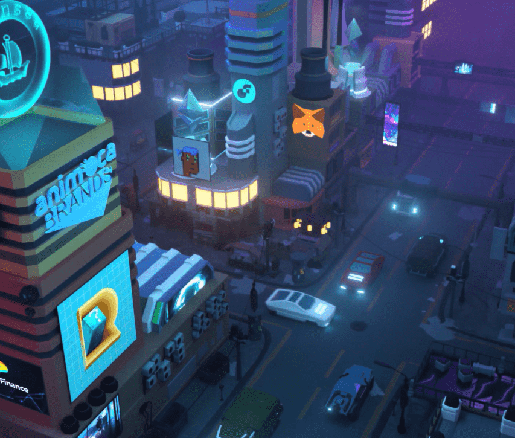

# MatrixWorld LandVoucher

Matrix World 是一个开放世界，使用户能够在多个区块链之上构建 3D 沉浸式应用程序。在 Matrix World 中，用户可以利用传统的 3D 开放世界功能，例如构建 3D 架构、举办虚拟会议、展示 NFT，以及更高级的功能，例如使用 Matrix 的内置计算资源创建自己的 3D 去中心化应用程序 (DAppsMatrix World 是一个独特的虚拟世界，将支持不同的区块链基础设施。玩家可以以不同的链上身份探索世界。创作者可以通过构建可以连接到外部服务和应用程序的沉浸式 3D 去中心化应用程序 (DApp) 来丰富和扩展世界。例如，玩家可以通过 OpenSea 和其他市场的 3D DApps 直观地交易和购买 NFT。

