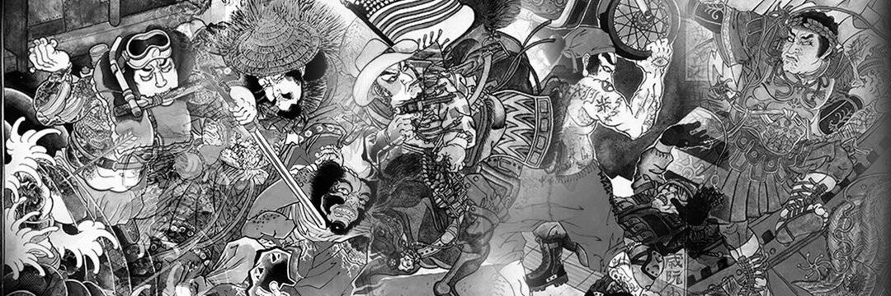

# MATSUZAKI

第一个真正的日本传统 NFT 项目。 具有日本传统和设计行业经验的双人组合。

创世纪系列现已上线！

“水光传传奇的现代英雄”

1/1，和纸+3D 渲染艺术品上的传统日本墨水。

松崎 NFT - 常见问题（FAQ）
▶ 什么是松崎？
MATSUZAKI 是一个 NFT（Non-fungible token）集合。存储在区块链上的数字艺术品集合。
▶ MATSUZAKI 代币有多少？
总共有 1 个 MATSUZAKI NFT。目前有 1 位所有者的钱包中至少有一个 MATSUZAKI NTF。
▶ MATSUZAKI 最近卖了多少？
过去 30 天内售出 0 个 MATSUZAKI NFT。

