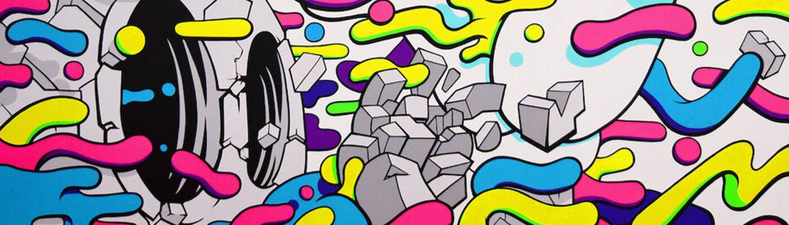

# Matt Gondek

Matt Gondek 是一位洛杉矶流行艺术家，他描绘了解构的流行偶像。 他开始在匹兹堡创作这些偶像的绘画和壁画，在搬到洛杉矶之前，他就定居在那里。 马特的作品开始受到关注，从而开始了他走向国际成功和知名度的道路。 如今，马特在 Instagram 上拥有超过 20 万的追随者，被 HypeBeast 等出版物多次报道，并且经常售罄他的版画、雕塑等。

Matt Gondek NFT - 常见问题（FAQ）
▶ 什么是 Matt Gondek？
Matt Gondek 是一个 NFT（非同质代币）集合。存储在区块链上的数字艺术品集合。
▶ 有多少个 Matt Gondek 代币？
总共有 1,379 个 Matt Gondek NFT。目前，206 位车主的钱包中至少有一个 Matt Gondek NTF。
▶ 最昂贵的 Matt Gondek 拍卖会是什么？
售出的最昂贵的 Matt Gondek NFT 是 The Best Revenge #185/727。它于 2022-08-07（22 天前）以 619 美元的价格售出。
▶ 最近卖出了多少 Matt Gondek？
过去 30 天内售出了 4 个 Matt Gondek NFT。

