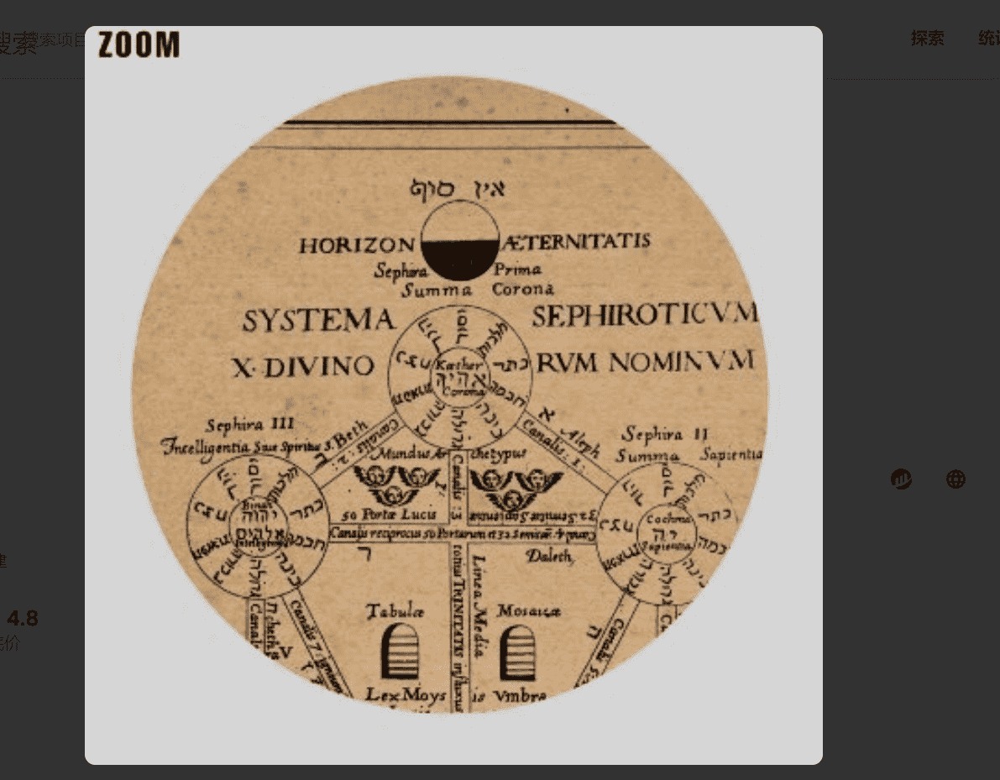

# Matthew Chaim

由 Matthew Chaim 在 sound.xyz 上创建

Matthew Ch 什么是 Matthew Chaim？

aim 是一个 NFT（不可替代代币）集合。存储在区块链上的数字艺术品集合。

存在多少个 Matthew Chaim 代币？

总共有 55 个 Matthew Chaim NFT。目前，33 位所有者的钱包中至少有一个 Matthew Chaim NTF。

最昂贵的 Matthew Chaim 拍卖会是什么？

售出的最昂贵的 Matthew Chaim NFT 是 [Nice Guy #24](https://www.nft-stats.com/asset/0x485d4489ce7d6c33368c010853cc3d1f3125f80a/24)。它于 2022 年 6 月 19 日（3 个月前）以 140 美元的价格售出。

最近卖出了多少 Matthew Chaim？

过去 30 天内售出了 1 个 Matthew Chaim NFT。

