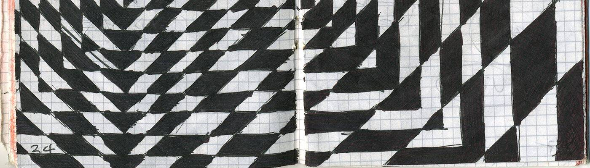

# Mattia Cuttini Produkt

自 1979 年以来，我一直怀着好奇心观察这个世界。我学习电子学并在该领域工作了 10 年，然后我将自己重新塑造为一名设计师。 音乐家，我一直在探索视觉和表演艺术，意识到我的研究是分层和重叠干预的问题。在 pixura.io 创建的智能合约

Mattia Cuttini 产品 NFT - 常见问题（FAQ）
▶ 什么是 Mattia Cuttini 产品？
Mattia Cuttini Produkt 是一个 NFT（非同质代币）系列。存储在区块链上的数字艺术品集合。
▶ 有多少个 Mattia Cuttini Produkt 代币？
总共有 124 个 Mattia Cuttini Produkt NFT。目前，81 位车主的钱包中至少有一个 Mattia Cuttini Produkt NTF。
▶ 最近售出了多少 Mattia Cuttini 产品？
过去 30 天内售出了 0 个 Mattia Cuttini Produkt NFT。

