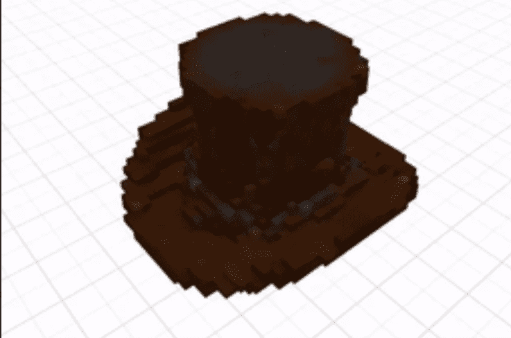

# Mattyc Wearables

一个隐体素系列，您可以在其中找到可穿戴设备来收集和穿戴！ Mattyc 可穿戴设备专为舒适、时尚而设计，有时甚至是为了乐趣！

Mattyc 可穿戴设备 NFT - 常见问题（FAQ）
▶ 什么是 Mattyc 可穿戴设备？
Mattyc Wearables 是一个 NFT（不可替代代币）系列。存储在区块链上的数字艺术品集合。
▶ 有多少个 Mattyc Wearables 代币？
总共有 62 个 Mattyc Wearables NFT。目前，96 位用户的钱包中至少有一个 Mattyc Wearables NTF。
▶ 最近卖出了多少 Mattyc 可穿戴设备？
过去 30 天内共售出 0 个 Mattyc Wearables NFT。

