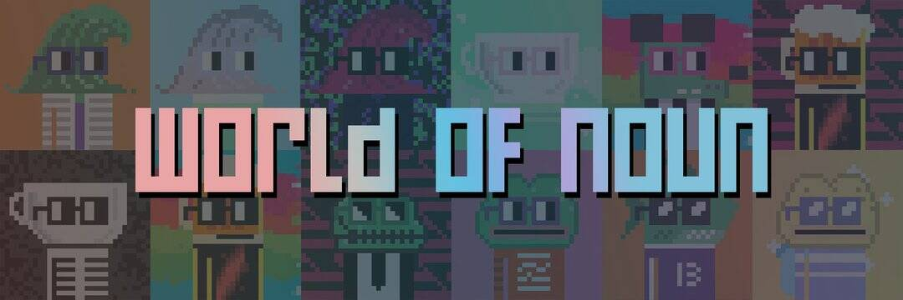

# MAX NOUN AND FRENS BY WORLD OF NOUN

XCOPY NFT 的 MAX PAIN AND FRENS 在过去 7 天内售出 35 次。MAX PAIN AND FRENS BY XCOPY 的总销售额为 $28.84k。XCOPY NFT 的 MAX PAIN AND FRENS 的平均价格为 823.9 美元。XCOPY 拥有 4,181 名 MAX PAIN 和 FRENS，总共拥有 7,469 个代币。

XCOPY NFT 的 MAX PAIN 和 FRENS - 常见问题 (FAQ)
▶ 什么是 XCOPY 的 MAX PAIN AND FRENS？
XCOPY 的 MAX PAIN AND FRENS 是一个 NFT（不可替代令牌）集合。存储在区块链上的数字艺术品集合。
▶ MAX PAIN AND FRENS BY XCOPY 代币有多少？
XCOPY NFT 总共有 7,469 个 MAX PAIN 和 FRENS。目前，4,181 位所有者的钱包中至少有一个 MAX PAIN AND FRENS BY XCOPY NTF。
▶ XCOPY 销售中最昂贵的 MAX PAIN AND FRENS 是什么？
XCOPY NFT 出售的最昂贵的 MAX PAIN 和 FRENS 是 GOURMET SPICY #1/24。它于 2022-06-06（3 个月前）以 30.3k 美元的价格售出。
▶ 最近卖出了多少 XCOPY 的 MAX PAIN AND FRENS？
过去 30 天内，XCOPY NFT 共售出 250 个 MAX PAIN AND FRENS。
▶ MAX PAIN AND FRENS BY XCOPY 的费用是多少？
在过去 30 天内，XCOPY NFT 的 MAX PAIN AND FRENS 最便宜的销售额低于 718 美元，最高销售额超过 1147 美元。过去 30 天内，XCOPY NFT 的 MAX PAIN AND FRENS 的中位价格为 823 美元。
▶ 什么是流行的 MAX PAIN AND FRENS BY XCOPY 替代品？
许多拥有 XCOPY NFT 的 MAX PAIN 和 FRENS 的用户还拥有 FVCK_AVATAR//、 DrifterShoots 的First Day Out 、 XCOPY 和 Deca和 rektguy的 Right Click Share 。

