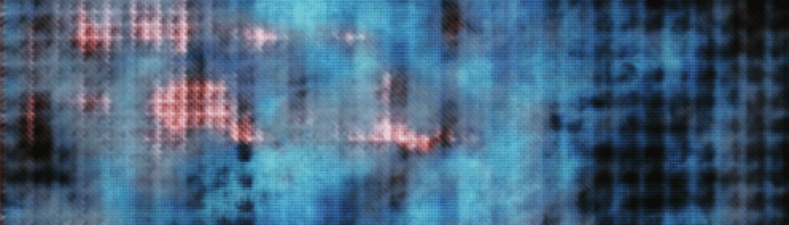

# MaxonBollocks

“Maxon Bollocks”是叙事驱动的 NFT 艺术收藏。 它同时是对艺术价值、死亡、道德美学、伦理和人类极限的沉思。 所有 NFT 均由自定义 GAN 生成 Maxon Bollocks 是一部中篇小说，共有 10 个章节。 Maxon 讲述了一位艺术家在 2021什么是 Maxon Bollocks？

“Maxon Bollocks”是叙事驱动的 NFT 艺术收藏。它同时是对艺术价值、死亡、道德美学、伦理和人类极限的沉思。在创造和收集越来越复杂的 NFT 艺术品方面进行了前所未有的实验。

-  3,888 个独特的 NFT
- 所有艺术都是由定制的 GAN 生成的。
- 由屡获殊荣的畅销书作家撰写。

艺术

所有 NFT 均由自定义 GAN（生成对抗网络）生成。我们将此项目视为 2021 年 GAN 艺术的时间胶囊。因此，该集合由 GAN 生成的大量图像组成。

它们的范围从非常简单的噪音到更高级的“迷你杰作”。抽象是整个集合的共同线程。年和他们追求 NFT 荣耀的故事。 www.maxonbollocks.com

