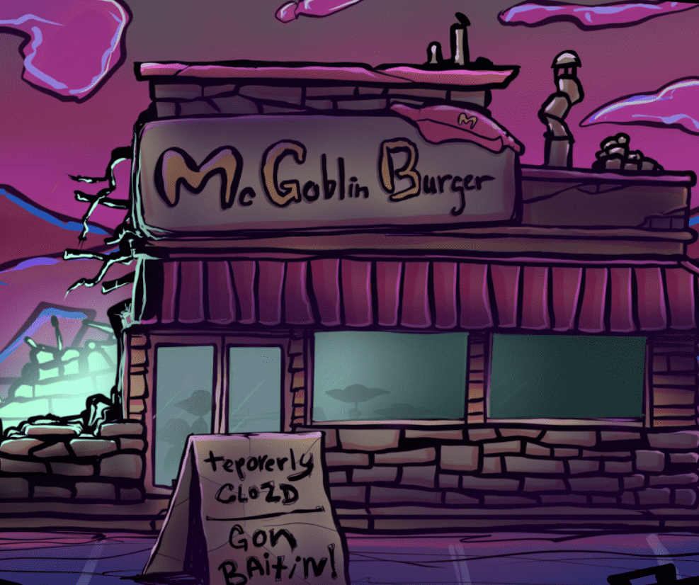

# McGoblin Burger

▶ 什么是 McGoblinBurger.WTF？

McGoblinBurger.WTF 是一个 NFT（非同质代币）集合。存储在区块链上的数字艺术品集合。

▶ 有多少个 McGoblinBurger.WTF 代币？

总共有 4,269 个 McGoblinBurger.WTF NFT。目前，636 位所有者的钱包中至少有一个 McGoblinBurger.WTF NTF。

▶ 最昂贵的 McGoblinBurger.WTF 销售是什么？

售出的最昂贵的 McGoblinBurger.WTF NFT 是 [Burger #3787]。它于 2022-06-07（3 个月前）以 36.3 美元的价格售出。

▶ 最近卖出了多少个 McGoblinBurger.WTF？

过去 30 天内售出了 68 个 McGoblinBurger.WTF NFT。

▶ McGoblinBurger.WTF 多少钱？

在过去 30 天里，最便宜的 McGoblinBurger.WTF NFT 销售额低于 3 美元，最高销售额超过 7 美元。McGoblinBurger.WTF NFT 在过去 30 天内的中位价格为 4 美元。

