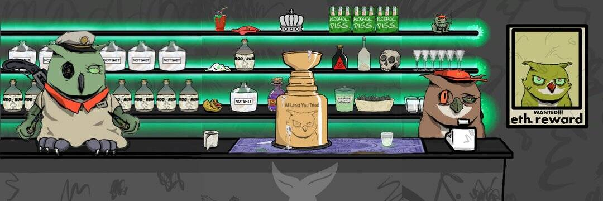

# Mchooty's DAO

McHooty 的社区 DAO 致力于为脏鸟和更大的 web3 社区提供长期战略价值和增长。DAO 中的投票权是拥有 McHooty 动态代币的功能。核心团队由相信将价值带回 creatives.follow @McHootys_wtf 了解更多。

Mchooty's DAO NFT - 常见问题（FAQ）

▶ 什么是 Mchooty's DAO NFT？

Mchooty's DAO是一个 NFT（Non-fungible token）集合。存储在区块链上的数字艺术品集合。

▶ 存在多少个Mchooty's DAO_NFT 代币？

总共有 23 个 Mchooty's DAO NFT。目前 2 位所有者的钱包中至少有一个 Mchooty's DAONTF。

▶ 最近卖出了多少 Mchooty's DAO NFT？

过去 30 天内售出 0 个 Mchooty's DAONFT。

