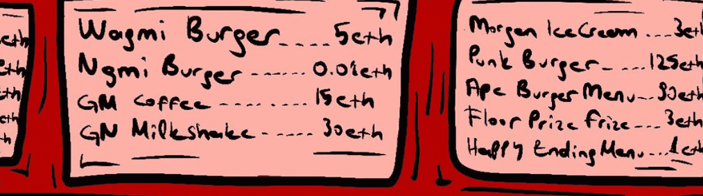

# McSeason.wtf

要记住2022年熊季，区块链和MC季Degen NFT系列将有所帮助。 3.333免费的薄荷NFT件MC。在过去的7天内没有麦克斯季节。WTF售出。

McSeason.wtf NFT-常见问题（FAQ）
▶什么是mcseason.wtf？
McSeason.wtf是NFT（不可杀死的令牌）系列。存储在区块链上的数字艺术品集合。
▶存在多少个McSeason.wtf代币？
总共有3,333个McSeason.wtf NFT。目前，有1,124名车主在钱包中至少有一个McSeason.wtf NTF。
▶最昂贵的McSeason.wtf销售是什么？
最昂贵的McSeason.wtf NFT是出售的 。它在2022-06-24（2个月前）以11美元的价格出售。
▶ 最近卖出了多少 McSeason.wtf？
在过去30天内售出了19个McSeason.WTF NFTS。
▶麦克斯赛季wtf的费用是多少？
在过去的30天中，最便宜的McSeason.WTF NFT销售额低于1美元，最高的销售额超过5美元。MCSEASON.WTF NFT的中位数价格在过去30天内为2美元。
▶流行的McSeason.wtf替代方案是什么？
许多拥有McSeason.wtf NFT的用户还拥有 客户， Sup Dudes， Host Memorial和 Man Cave Man的Homiez 。

