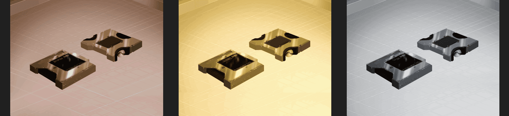

# Bank of Metaverse Pass Collection

800 个质押 NFT 的有限集合。 元界 DAO 银行的会员资格和所有好处都来自持有元界 DAO 通行证。 https://t.me/metaversda0
让我们建立未来
 Defi 3.0 FAAS项目 - 代表农场 - 服务
 在我们的DAPP上可以要求的3％ETH奖励
 社区决定如何使用财政部。低，中，高风险APY。
 每笔交易的百分比分配给国库
hostcloud

metavers dao
让我们建立未来
 Defi 3.0 FAAS项目 - 代表农场 - 服务
 在我们的DAPP上可以要求的3％ETH奖励
 社区决定如何使用财政部。低，中，高风险APY。
 每笔交易的百分比分配给国库
什么是metavers dao？
Metaverse DAO 是一个革命性的农场即服务项目
，在以太坊链上运行。该项目
旨在允许用户从
各个网络中的产量耕作中被动地赚取奖励。

该项目的设计方式使用户可以从代币税中以反射形式被动地赚取收益，该税还将为项目的财政钱包提供资金，然后将其用于在不同区块链上产生收益。

$ mdao将是以太坊的储备货币。为了维持价格稳定性，元元将使用储备货币算法，也将得到其他分散资产的支持。

Metavers Dao专注于长期和盈利的财政基金分配。我们的任务是使用从用户分配到NFT游戏开发，3D和Metaverse VR游戏的财政资金，以及直接投资于对元游戏和P2E有长期远见的团队和公司！这将根据 Metaverse DAO 成员做出的多数决定通过社区投票来实现。

