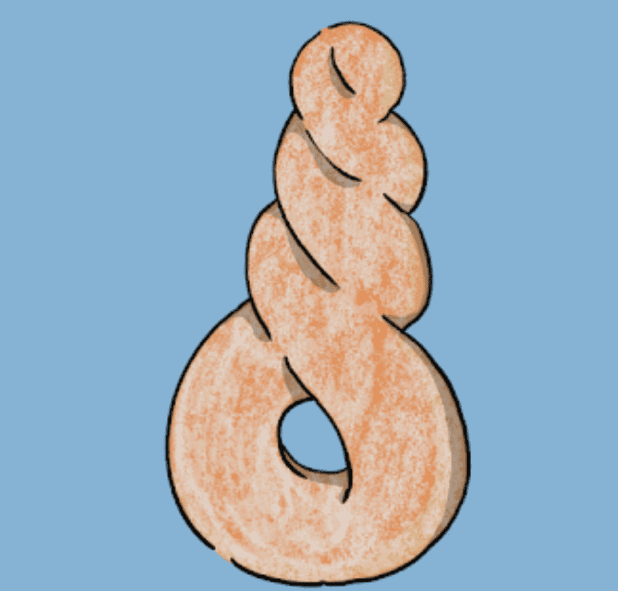

# Me2 Donuts

Me2是“模因”。Me2 是“我也是”。Me2是“见面”。

这些甜甜圈可以通过 freemint 获得。108 个甜甜圈售罄，1072 分钟后，一个甜甜圈从盒子里出来。然而，这些甜甜圈之间几乎没有视觉差异。每个甜甜圈只有不同和独特的情感和取向。

拿着这个甜甜圈是“我不单凭外表来判断”的声明。

2021 年 7 月，我第一次去 OpenSea 进行 MINT 工作，完全沉浸在 NFT 的世界中。我运行多个系列，但主要的是我用作图标的角色。他是一个“经理”，他已经完全沉迷于他最喜欢的螺丝钉甜甜圈并开始与他们一起生活。在 NFT 界被称为“Screw Screw Donut Manager”。

本站从我为什么创作《Neji Neji Donut Manager》的故事开始，输出我在创作活动中获得的失败、成功、遗憾等各种封闭体验。我们的目标是创建内容，让读者重温一个人如何创建和培育 IP“Neji Neji Donut Manager”，以及它如何走向 Web3 世界

