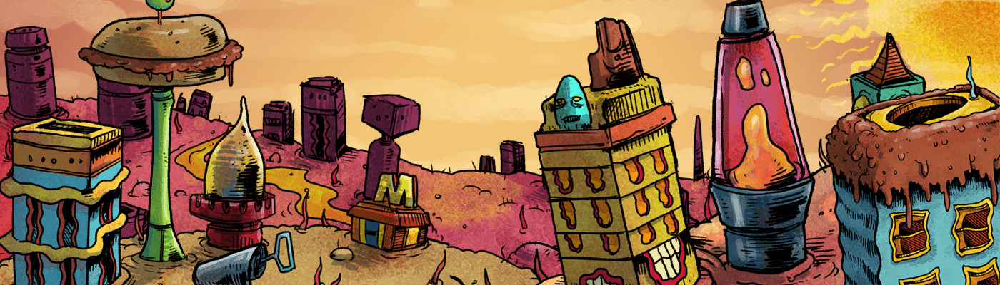

# MeatCubes

肉饼是以太坊区块链上6,969个NFT的生成收藏。 每个肉壳都来自150多个随机选择的零件！

Cubes.wtf？

肉饼是以太坊区块链上6,969个NFT的生成收藏。每个肉壳都来自150多个随机选择的零件！

Wen Cubes？

肉饼现在已经活了！

加入Discord，并在Twitter上关注我们，以跟上Meatcubes的最新消息！

曾经有一颗行星，名叫卡尼斯。位于一些未知星系的外边缘上，是所有辐射的倾倒地面和宇宙中不需要的垃圾。地球上以肉类和肉类替代品为基础的生命形式和平和谐地生活，直到有一天一个邪恶的人物降临在他们身上......

卡尼斯公民在每年的肉类狂欢节上庆祝，这是一个被称为Brocolli Rabe击中的人。他早就知道卡尼斯的温度控制系统中潜伏着一个弱点。该系统对于行星的稳定性至关重要，负责保持最佳的烹饪温度。通过修改温度模块，他能够迫使加热激光器过载，将Carnis爆炸成微小的钻头，同时突变和发送肉块在宇宙上旋转！

