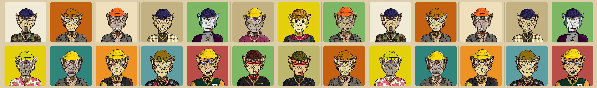

# Mebs NFT

Mutant Ether Babies NFT 合集 - 具有 340 多种特征的超 4K 基因工程物种生活在以太坊 ERC721 网络上 | 地铁游戏和元宇宙。我们拥有一个伟大的专家社区，他们孜孜不倦地完成我们的元宇宙和地铁游戏，以按时赢得游戏。 300 Mebs 将分配给我们的游戏玩家的游戏钱包，200 Mebs 将保留用于赠品、合作和促销活动。代币化将在我们项目的第二阶段引入，我们收藏品的持有者将通过持有他们的 Mebs 获得被动收入。

Mebs NFTN FT-常见问题（FAQ）
▶什么是Mebs NFT？
Mebs NFT是NFT（不可杀死的令牌）系列。存储在区块链上的数字艺术品集合。
▶ 有多少Mebs NFT 代币？
总共有 21 个 Mebs NFT NFT。目前 2 位所有者的钱包中至少有一个 Mebs NFT NTF。
▶ TheMebs NFT 最近卖出了多少？
在过去30天内，有0个Mebs NFT NFT售出。

