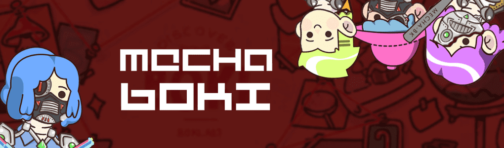

# MechaBoki

Mecha-Boki 是一个以社区为中心的项目，以协作和连接为中心。 欢迎来到我们的机甲世界，在这里您的成人想象力与您内心的孩子想象力相遇！

MECHA-BOKI NFT

Mecha-Boki 是一个以社区为中心的项目，以协作和连接为中心。欢迎来到我们的机甲世界，在这里您的成人想象力与您内心的孩子想象力相遇！

MechaBoki NFT 在过去 7 天内售出 1 次。MechaBoki 的总销售额为 9.55 美元。一份 MechaBoki NFT 的平均价格为 9.5 美元。MechaBoki 拥有者 3,296 名，总供应量为 6,969 个。

