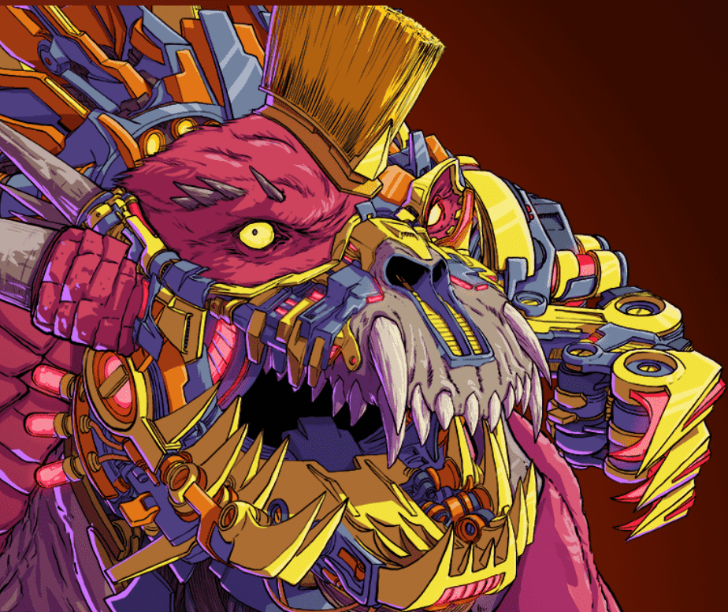

# Mecha Chaotic: Bedlam

机械混沌是一种艺术的第一体验。

无论是帮助打造 Metabeing 在直播期间的外观，还是通过交互式铸造仪式，您和社区做出的决定不仅决定了您获得的效果，而且决定了整个收藏的效果。

机甲出生于五个派系之一 - 众、圣所、GL-4M、虚空和巴罗斯。

拥有来自任何 Mecha Chaotic 收藏的作品可以让您访问社区，并通过直播帮助制作元生物，获得由 Ethan S. Brewerton 现场绘制的定制衍生品，以及未来将创建的所有其他活动！

欢迎来到一个充满疯狂、笼罩在神秘之中、由你打造的宇宙

