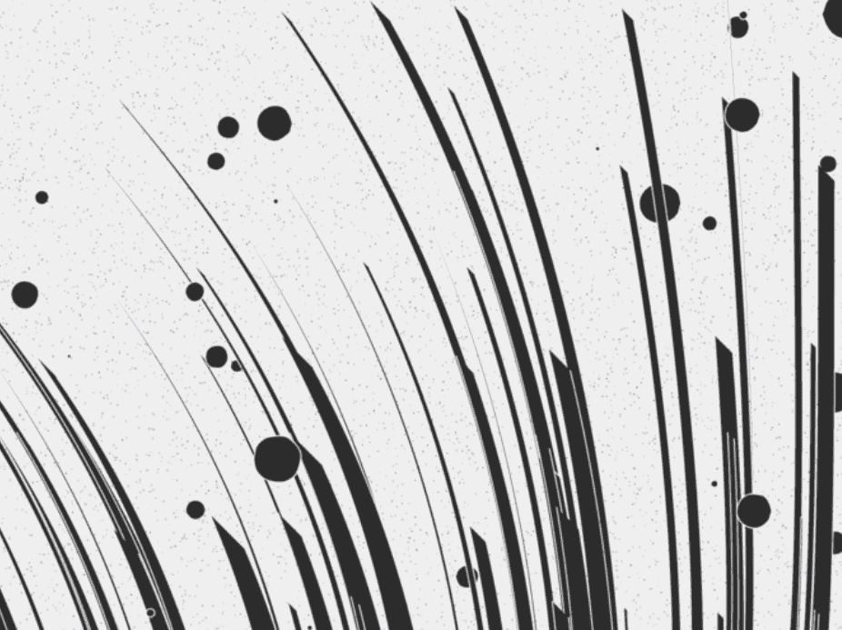

# Mechanized Abstractions

与为在个人资料图片中使用而优化的 NFT 项目不同，机械化抽象针对可用于横幅（例如 Twitter 横幅）的宽高比进行优化为 Twitter 横幅优化的生成艺术

▶ 什么是机械化抽象？

机械化抽象是一个 NFT（不可替代令牌）集合。存储在区块链上的数字艺术品集合。

▶ 存在多少机械化抽象代币？

总共有 1,234 个机械化抽象 NFT。目前，594 位所有者的钱包中至少有一个机械化抽象 NTF。

▶ 最昂贵的机械化抽象销售是什么？

出售的最昂贵的机械化抽象 NFT 是 [机械化抽象 #142它于 2022-06-24（2 个月前）以 97.7 美元的价格售出。

▶ 最近卖出了多少机械化抽象？

过去 30 天内售出了 27 个机械化抽象 NFT。

▶ 机械化抽象的成本是多少？

在过去 30 天里，最便宜的机械化抽象 NFT 销售额低于 5 美元，最高销售额超过 31 美元。过去 30 天内，机械化抽象 NFT 的中位价格为 22 美元

