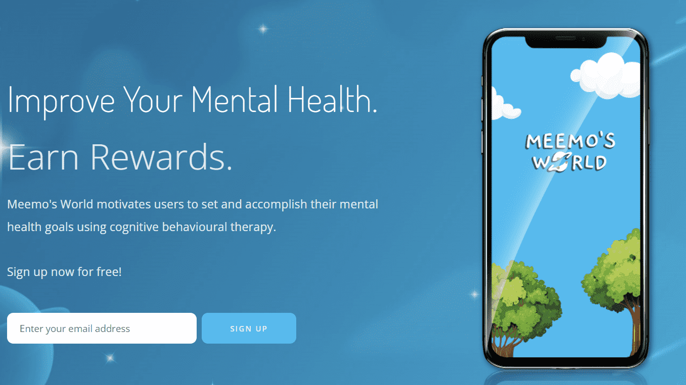

# Meemos World

通过 Meemo 应用程序收集 6,666 个 NFT 游戏化疗法！

由临床医生主导的 Meemo's World 旨在提高数字心理健康解决方案的可访问性和粘性，同时为该领域的人们建立一个安全的社区:)

我们是什么？

嘿嘿！Meemo's World 是一个安全的空间。这是一个人们可以对他人表达感激和同理心的地方，并更多地了解如何改善他们的心理健康。

我们是以太坊区块链上的 NFT 集合，其总体目标是提高心理健康解决方案的可访问性和有效性。我们希望做到这一点，同时利用我们社区的力量开始打破围绕心理健康的耻辱，并解决在现实生活中未被认可的人群的人口统计数据。

在过去的一年里，我们一直在构建一个游戏化的认知行为治疗应用程序，其中心是创造一种有趣且可持续的方式来照顾您的心理健康。Meemo's World 是我们想要在我们喜欢的空间中传达这个信息的方式~

