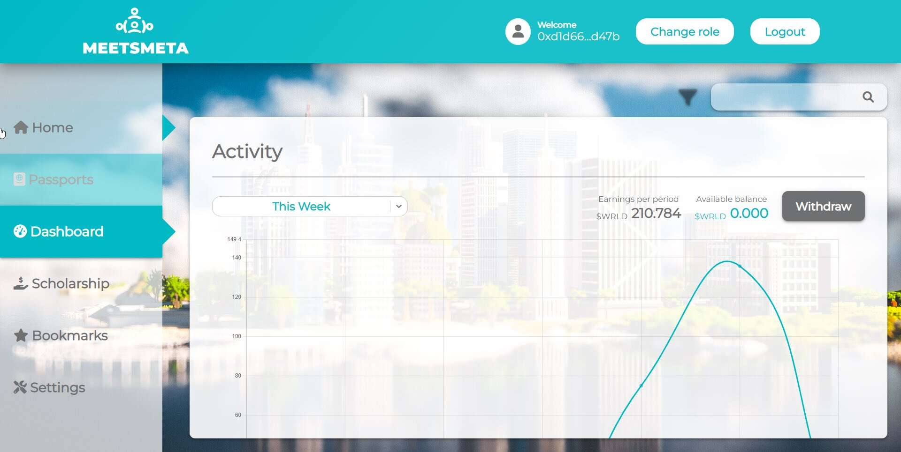

# Meets Meta Passports

MeetsMeta 是赚取元节的独特游戏。我们的护照允许持有人获得被动收入，并从超过 16,000 名独特的游戏玩家中进行选择，通过我们的专利奖学金计划赚取 $ WRLD 代币，同时允许护照持有人（公民）在 Meetsmeta 接收虚拟资产和房地产的空投.

Meets Metaverse 是建立在 NFT Worlds 之上的下一级 Metaverse，具有基于通行证的独家访问 Metaverse，世界各地的人们都可以访问区块链 Metaverse 的好处：p2e 游戏、独家收藏品和可穿戴设备、数字商品，数字房地产，并可以与互联网明星一起参加独家活动。

