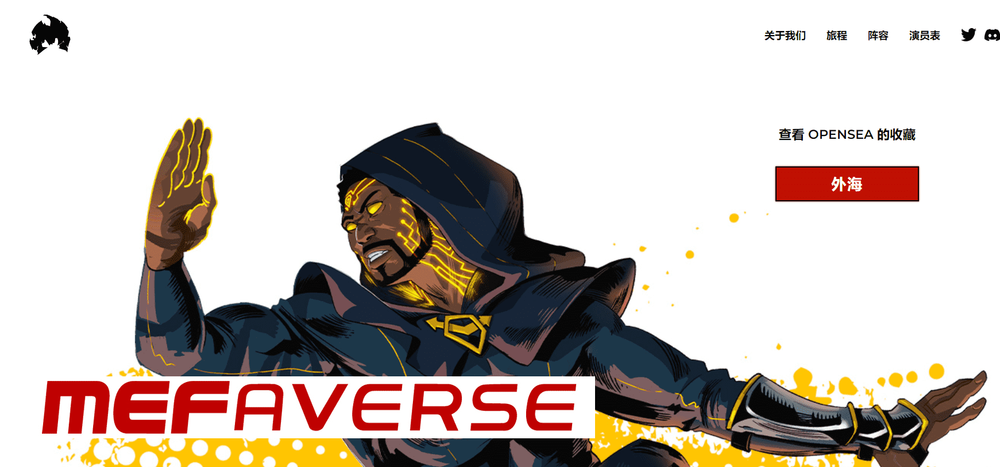

# MEFaverse

这是 WuTang Clan Method Man 的 MEFaverse，嘻哈文化、游戏、艺术、科技、娱乐和漫画书在这里碰撞。受到 Method Man 本人的愿景以及专家和创新领导者团队的启发，MEFaverse 努力突破与 NFT/metaverse 相关的所有事物的界限。在 Twitter 上关注我们并加入 Discord 以获取所有最新的 Alpha，并永远记住——“我们是路线图。我们就是解决方案。” 欢迎来到派对。

是第一个虚拟世界（Wu York City），持有者可以在其中体验图画小说，而不仅仅是阅读它。故事围绕着 Method Man 展开，他是有史以来最伟大的嘻哈乐队 Wu-Tang Clan 的创始成员，在这个世界里，他成为了一个真正的超级英雄，而不仅仅是一个抒情的英雄。

该项目以适合所有年龄段的格式结合了嘻哈、滑板和漫画书的所有内容。这是现实生活 (IRL) 与元节相遇的地方。

