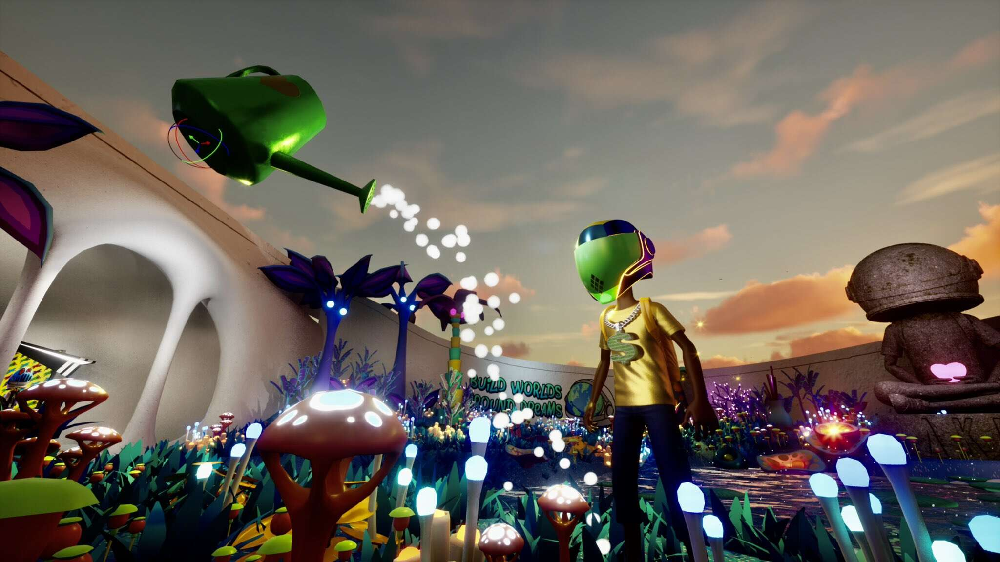

# Mega OG Chapters

Mega OG Chapters 是一系列动画故事，介绍了 Akutar 系列中的 Mega OG 角色。

Aku 是世界上最早的数字探索者之一，他的自信和独创性使他肩负着一项使命，即证明没有太大的梦想，没有太大的障碍🚀🚀

Aku 是由前 MLB 球员转为艺术家 Micah Johnson 创作的。Micah 是一位自学成才的具象艺术家，他使用强烈的手势线条和松散的笔触来创作主要以非洲裔美国儿童为主体的戏剧性肖像。这些主题经常受到他年轻的侄子的启发，自从他无意中听到他 4 岁的侄子问：“宇航员可以是黑人吗？”后，他就开始出现在 Micah 的作品中。在看到对他的画作的压倒性反应后，Micah 意识到他需要扩大这一信息以覆盖更广泛的人群，他创造了一个名为 Aku 的动画角色。
Micah 于 2021 年 2 月推出了 Aku 作为动画 3D NFT，得到了来自加密货币和 NFT、艺术、音乐和文化领域的广泛社区支持，包括合作伙伴 Summer Watson 和创始 Aku 创意委员会成员 Pusha-T 和 Upscale Vandal。在 Aku 成立的第一年，Aku 背后的团队不断壮大，囊括了任何行业的一些顶级动画、创意设计、技术和社区管理专业人士。在这里认识我们！

