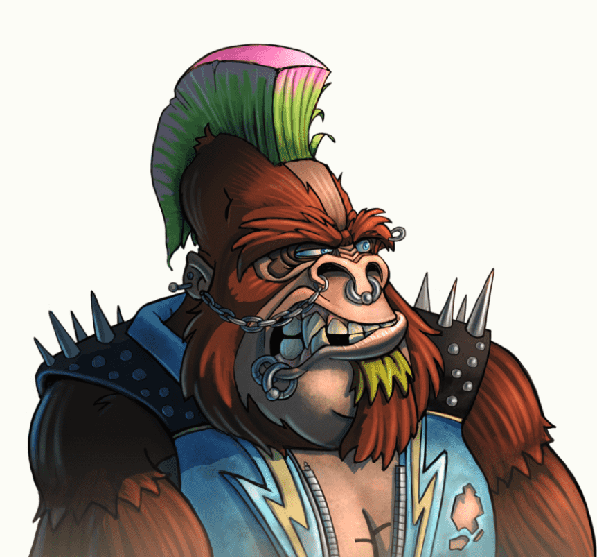

# MegaKongs

MegaKongs 是 Megapont 宇宙的第一个社区扩展。Kongs 提供 Megapont 生态系统的正式会员资格，它们具有类似于 Megapont Apes 的特权和实用性。Megapont 是 Stacks 和 Ethereum 上的 NFT 项目。MegaKongs 生成薄荷使用[Apes Together]开发的突破性技术。拥有 300 多个精心制作的特征，生成的 MegaKongs 与我们的 84 个独特的 1/1 Kongs 一样具有个性，因此每个人都有一个 Kong。

MegaKongs 是以太坊区块链上 Megapont 生态系统的扩展，于 2022 年 4 月 11 日推出

MegaKongs 将成为 Megapont 的正式会员。该实用程序将类似于 Megapont Apes，但与我们“Apes are Kings”的立场成正比。

