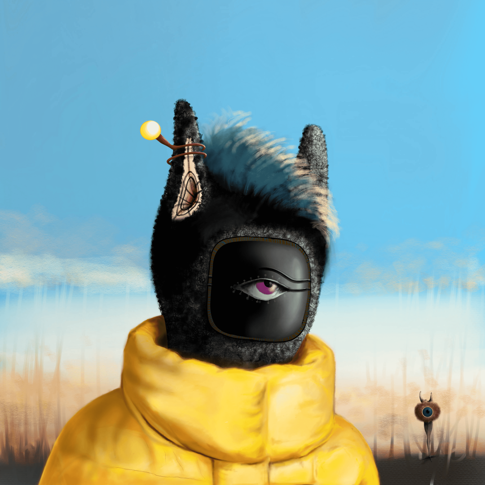

# Megaland Aliens OfficiaI

Megaland 的想法是受到荣格梦理论的启发，并演变成一个虚构的故事，发生在梦中共享的土地 Megaland。故事从一个奇怪的电磁波撞击地球开始。它使一群人的梦想相互交叉，并在他们的梦想中发现了一个共同的世界。

进入 Megaland 的人们以一种新的形式体验生活，这种新形式是基于他们在地球上的生活事件而形成的。对于新的 Megalandiers，新的体型和能力通常是陌生的。问题是谁是外星人？梦想家还是他/她自己的 Megalandier？！

该项目采用艺术超现实的方法根据故事创建独特的 NFT。

