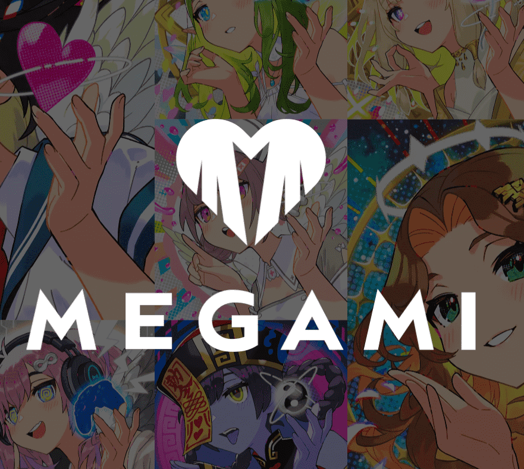

# MEGAMI_NFT

MEGAMI 是一个 NFT 项目，将 Naoki Saito 的 1/1 质量概念化为收藏品。你自己的女神，不为任何人。您选择的 Megami 将赋予您力量。当您在寻找女神时，您会发现您正在寻找自己。这恰恰是对自己价值的重新发现。我通过 NFT 表达的插画其实一直在描绘自己的“梦想”**。

第一个梦想，创造者获得公平报酬的未来。通过“GESTURES”系列，NFT 提供的可能性，以创造力的名义，表现主义者获得公平的利益而不会受到不公平的剥削。
我曾梦想过这样的未来。在它的下一个系列中，“BRILIANT”。第二个梦想……不是那种为了大众消费而扼杀个性的创意。艺术家可以充分发挥自己的个性，你在发光！我表达了那些梦想。并在下一个系列中展示，“MEGAMI”。第三个梦想是前一个梦想的延续。这是“更多人相信自己的未来”。

