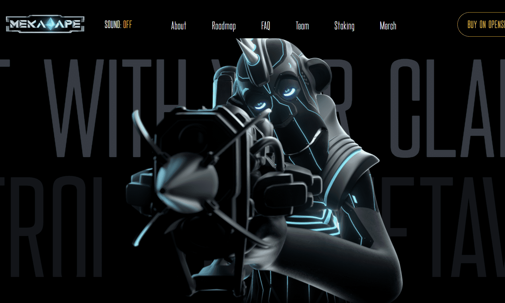

# Meka Ape Club (Official)

Meka Ape Club 是 5,640 只生成 3D 猿的集合。在我们于 2022 年第四季度发布的 P2E Metaverse 射击游戏中扮演您的猿猴。每只猿猴都有实用性和特权，包括赌注。加入我们的 Discord 并发现 MAC。

麦卡知识
在人类毁灭自己之后，麦卡猿族来到地球，提取生存所必需的资源。
阻止麦卡猿从被摧毁的地球上提取铍资源，这是他们生活的燃料，他们有了一个新的复仇者。未知生物控制了局面。现在麦卡猿必须拥抱生存的战场。
它们猖獗，正在地球上造成严重破坏。麦卡猿需要在这场即将到来的战斗中证明他们的技能。准备单独作战，与氏族或联盟。

在我们的第三人称射击游戏，有5个派别，你可以发挥作为。塔列里亚人、埃泽利亚人、萨堪尼人、拉札里亚人和阿塔米尔人。也有没有派别的。这些梅卡人在寻找目标和归属感。

