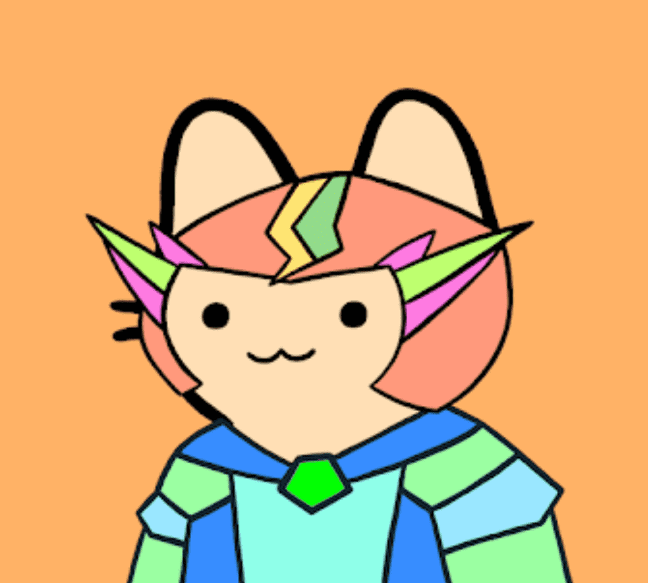

# MekaCats

以编程方式生成的可爱 MekaCats 的任务是捕捉涌入 Metaverse 的变种人。

MekaCats 是一个 DAO，它为其成员捕获和细分 Mutant Cats。在金库中，$MECH 代币代表 Mutant Cats NFT 的部分股份。可以通过质押您的 MekaCats 来获得代币

▶ 什么是 MekaCats？

MekaCats 是一个 NFT（非同质代币）集合。存储在区块链上的数字艺术品集合。

▶ 存在多少 MekaCats 代币？

总共有 3,203 个 MekaCats NFT。目前，402 位所有者的钱包中至少有一个 MekaCats NTF。

▶ 最近卖出了多少只 MekaCat？

过去 30 天内售出 0 个 MekaCats NFT。

