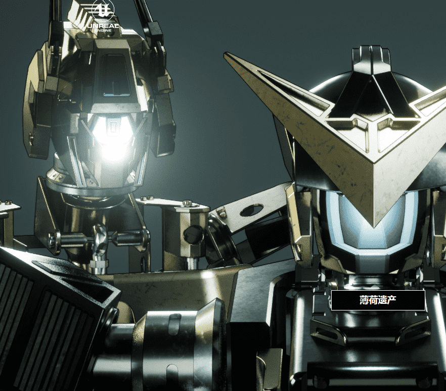

# Mekaformers

1,500 名 Mekaformers准备战斗的Mekaformers 是一个包含 1,500 个生成机器人的集合，其中包含数百个元素，这些元素使它们中的每一个都真正独一无二且令人难以置信的史诗。

每个机器人本身就是一件杰作，其特征包括不同的动画和声音。Mekaformers 是元节就绪和游戏就绪的资产，直接来自虚幻引擎 5。

Mekaformers 已准备好在虚幻引擎 5 中使用，在发布 1 周后，我们将把文件上传到网站，供每位想要构建游戏或探索其 Mekaformers 在虚幻引擎 5 中的功能的持有者使用，每一个贡献于我们的宇宙总是受欢迎的。Mekaformers 已准备好被社区使用

