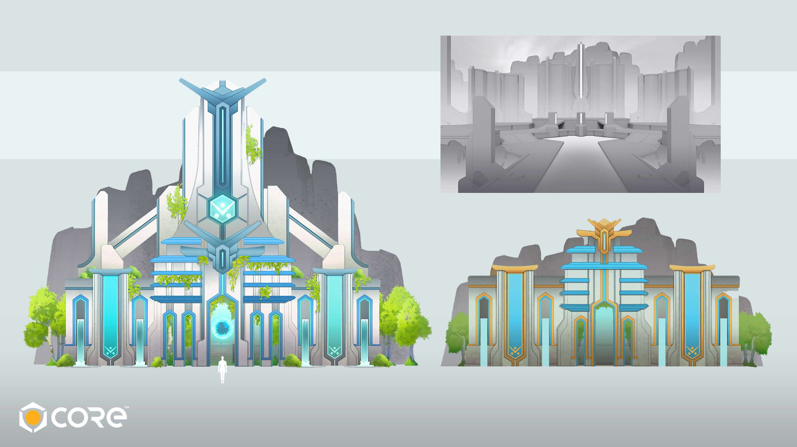

# MekaVerse Factory

MekaVerse Factory 是一个 MekaVerse 扩展，您可以在其中发现仅对 Meka Drivers（Meka 持有者）可用的新插图和合作！

在 MekaVerse 的交互式地图上选择发送 NFT 的位置。探索主要的首都、古代战场或祖传遗迹，等待他的归来获得奖励，甚至定制你的 Meka-Bots！

MekaVerse Factory NFT 在过去 7 天内售出 12 次。MekaVerse Factory 的总销售额为 221.76 美元。一个 MekaVerse Factory NFT 的平均价格为 18.5 美元。共有 3,356 名 MekaVerse 工厂所有者，总共拥有 2 个代币。

▶ 什么是 MekaVerse 工厂？
MekaVerse Factory 是一个 NFT（不可替代代币）集合。存储在区块链上的数字艺术品集合。
▶ 存在多少 MekaVerse Factory 代币？
总共有 2 个 MekaVerse Factory NFT。目前，3,356 位车主的钱包中至少有一个 MekaVerse Factory NTF。
▶ 什么是最昂贵的 MekaVerse 工厂销售？
出售的最昂贵的 MekaVerse Factory NFT 是 Look Up。它于 2022-06-07（3 个月前）以 123.2 美元的价格售出。
▶ 最近卖出了多少 MekaVerse Factory？
过去 30 天内售出了 81 个 MekaVerse Factory NFT。
▶ MekaVerse 工厂的成本是多少？
在过去 30 天里，最便宜的 MekaVerse Factory NFT 销售额低于 13 美元，最高销售额超过 49 美元。MekaVerse Factory NFT 的中位价在过去 30 天内为 22 美元。

