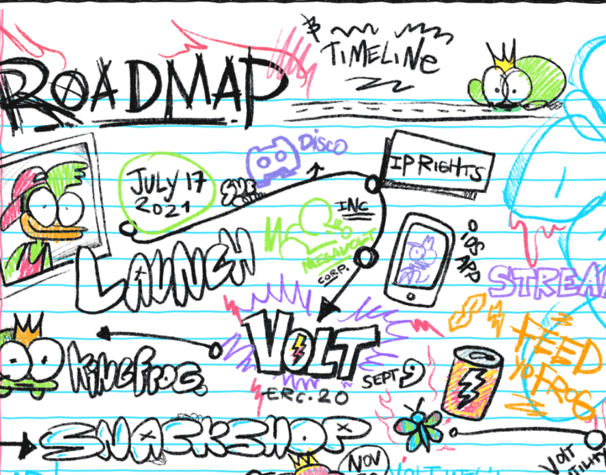

# Melvin's Snacks

欢迎来到梅尔文的小吃店。有粘性蠕虫甜食或修复失败伏特可乐？梅尔文得到了他们所有。KingFrog 最喜欢的一站式商店

▶ 什么是 Melvin's Snacks？

Melvin's Snacks 是一个 NFT（不可替代令牌）集合。存储在区块链上的数字艺术品集合。

▶ Melvin's Snacks 代币有多少？

总共有 4 个 Melvin's Snacks NFT。目前，196 位业主的钱包中至少有一份 Melvin's Snacks NTF。

▶ 什么是最昂贵的 Melvin's Snacks 销售？

售出的最昂贵的 Melvin's Snacks NFT 是 [冰淇淋。它于 2022-08-18（17 天前）以 28.1 美元的价格售出。

▶ 最近卖出了多少Melvin's Snacks？

过去 30 天内售出了 2 个 Melvin's Snacks NFT。

