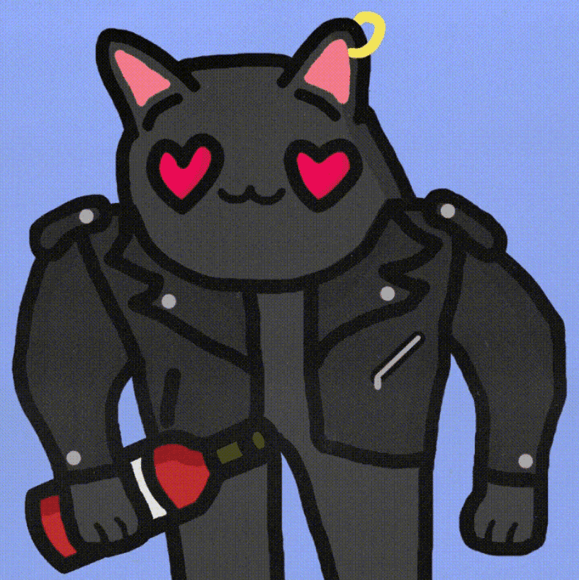

# Meme Cats NFT

受数字文化和模因启发的 2500 件手绘 CC0 作品的集合

▶ 什么是 Meme Cats NFT？

Meme Cats NFT 是一个 NFT（不可替代令牌）集合。存储在区块链上的数字艺术品集合。

▶ Meme Cats NFT 代币有多少？

总共有 2,500 个 Meme Cats NFT NFT。目前，885 位所有者的钱包中至少有一个 Meme Cats NFT NTF。

▶ 最昂贵的 Meme Cats NFT 销售是什么？

出售的最昂贵的 Meme Cats NFT NFT 是 [Meme Cats #1551]它于 2022 年 6 月 9 日（3 个月前）以 10.9 美元的价格售出。

▶ 最近卖出了多少 Meme Cats NFT？

过去 30 天内售出了 16 个 Meme Cats NFT NFT。

▶ Meme Cats NFT 需要多少钱？

在过去 30 天里，最便宜的 Meme Cats NFT NFT 销售额低于 1 美元，最高销售额超过 5 美元。在过去 30 天内，Meme Cats NFT NFT 的中位价格为 2 美元。

