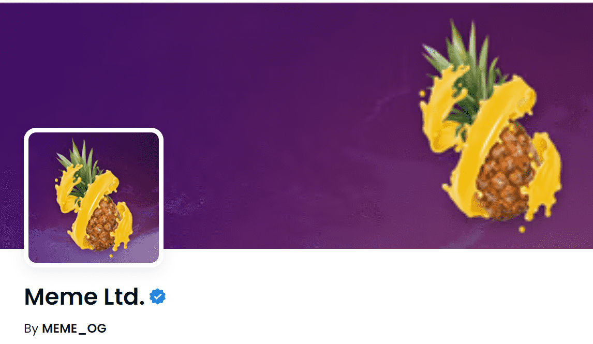

# Meme Ltd.

Meme 是一种实验性协议，融合了 DeFi 和加密收藏品中一些最令人兴奋的创新。通过种植独家 NFT 模因，让您的 $MEME 发挥作用。质押 LP 代币以访问我们的一批传奇卡。

Meme Ltd. NFT 在过去 7 天内售出 31 次。Meme Ltd. 的总销售额为 851.96 美元。Meme Ltd. NFT 的平均价格为 27.5 美元。有 8,425 名 Meme Ltd. 所有者，总共拥有 521 个代币。

什么是 Meme Ltd.？

Meme Ltd. 是一个 NFT（非同质代币）集合。存储在区块链上的数字艺术品集合。

 有多少 Meme Ltd. 代币？

总共有 521 个 Meme Ltd. NFT。目前，8,425 位所有者的钱包中至少有一个 Meme Ltd. NTF。

