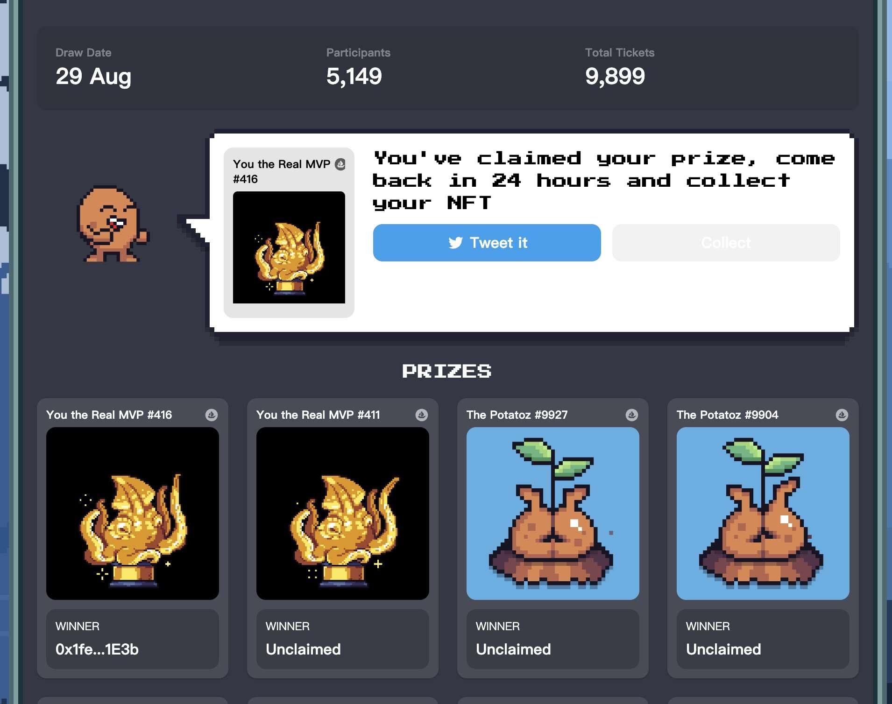

# MEMELAND BY 9GAG OFFICIAL COLLECTION

9GAG 成立于 2008 年，其使命是让世界更快乐。

9GAG 在我们的网站、应用程序、Instagram、Facebook、Twitter和TikTok上拥有 2 亿全球观众。

9GAG 得到 First Round Capital、Freestyle Capital、Greycroft Partners、True Ventures、Y Combinator、500 Startups 等的支持。

Memeland 是 9GAG 的 web3 生态系统，又名 Memetaverse，显然是双关语。

MEMELAND 不仅仅是 JPEG
年份是[编辑]。9,999 名船长与他们的海盗船员一起探索破碎海，寻找被称为“Memeland”的世界传奇宝岛。与他们一起寻求荣耀、财富、爱情，当然还有……模因。

“MEMELAND CAPTAINS”是 Memeland 的主要系列。它是 9,999 个启用实用程序的 PFP 的集合。每位队长都可以解锁 $MEME、私人俱乐部会员资格、对创作者 NFT 市场的独家访问权、IRL 活动、即将到来的 Memeland 和 9GAG 掉落等等。

