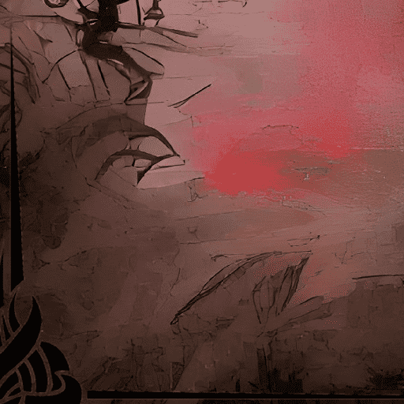

# MementoMoriNFT

MementoMoriNFT NFT 在过去 7 天内售出 17 次。MementoMoriNFT 的总销售额为 169.94 美元。一份 MementoMoriNFT NFT 的平均价格为 10 美元。共有 127 名 MementoMoriNFT 所有者，总共拥有 339 个代币。

收藏2222。你只活一次。去吧。不后悔

▶ 什么是 MementoMoriNFT？
MementoMoriNFT 是一个 NFT（Non-fungible token）集合。存储在区块链上的数字艺术品集合。
▶ 存在多少 MementoMoriNFT 代币？
总共有 339 个 MementoMoriNFT NFT。目前 127 位所有者的钱包中至少有一个 MementoMoriNFT NTF。
▶ 最昂贵的 MementoMoriNFT 销售是什么？
出售的最昂贵的 MementoMoriNFT NFT 是 MomentoMori Hidden。它于 2022-06-28（2 个月前）以 19.8 美元的价格售出。
▶ 最近卖出了多少 MementoMoriNFT？
过去 30 天内售出了 17 个 MementoMoriNFT NFT。
▶ MementoMoriNFT 需要多少钱？
在过去 30 天里，最便宜的 MementoMoriNFT NFT 销售额低于 5 美元，最高销售额超过 17 美元。在过去 30 天内，MementoMoriNFT NFT 的中位价格为 8 美元。

