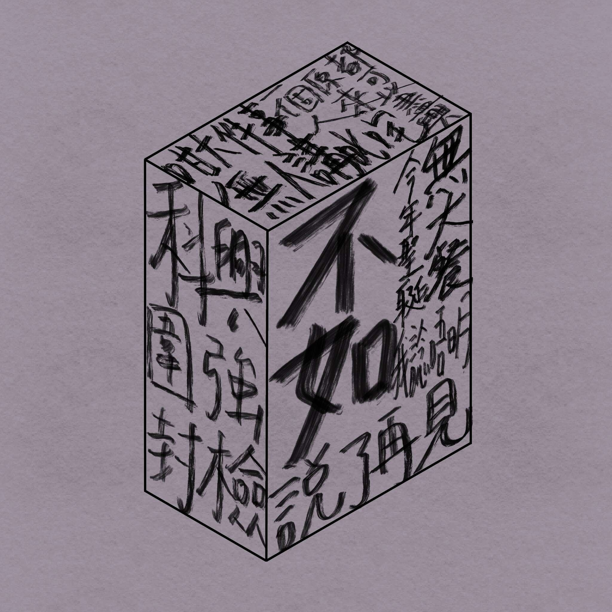

# Memorable.Cube

元宇宙中的香港记忆。Memorable Cube 以包含 1,000 个单词短语的集合开始，其中包含香港 2019 年至 2022 年的许多标志性事物和特殊时刻。我们的团队很乐意在元界中为持有者提供一个去中心化的香港未来。

我们一起哭。我们一起崛起。我们一起成长。

▶ 什么是 Memorable.Cube？
Memorable.Cube 是一个 NFT（Non-fungible token）集合。存储在区块链上的数字艺术品集合。
▶ 有多少 Memorable.Cube 代币？
总共有 1,000 个 Memorable.Cube NFT。目前 2 位所有者的钱包中至少有一个 Memorable.Cube NTF。
▶ 最近卖出了多少个 Memorable.Cube？
过去 30 天内售出了 0 个 Memorable.Cube NFT。

