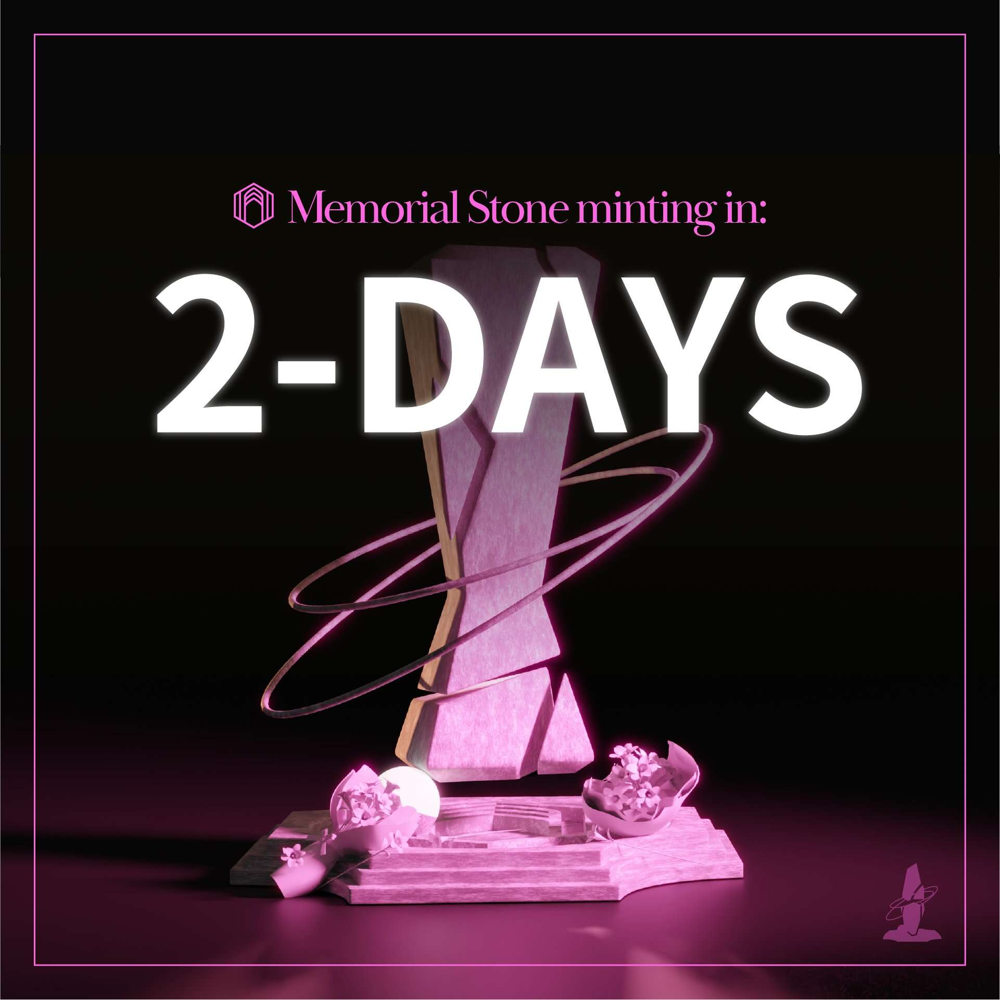

# Memorial Block

请记住，世界上第一次纪念 NFT是一个纪念您所爱、尊重和钦佩的人的地方，这些人今天已不在我们身边。“记住”由1024个独特的纪念街区组成，您可以在其中纪念那些在我们面前逝去的人，以便与世界一起被铭记。每个纪念块都是一个 NFT（不可替代令牌），这意味着它是您的，并且永远属于您。 
当我们意识到区块链的属性有能力永久保存珍贵的数据时，Remember 项目就开始了——不可变且透明。我们每个人都有一个我们希望今天在这里的人。有了Remember，我们心爱的人就生活在区块链上，并被永远铭记。

