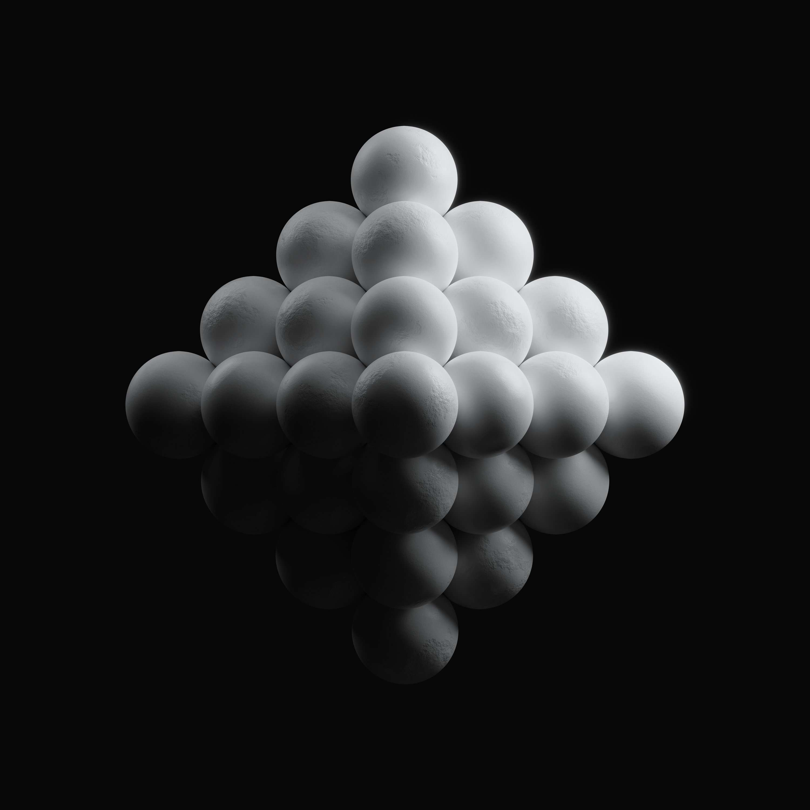

# Memories of an Automaton

一个动态的 NFT 集合，显示所有者钱包中持有的 NFT 的实时流。NYX x SECONDSTATE。

创建了两个动态 NFT 中的第一个，它将持有者 NFT 钱包的实时收藏显示为记忆。

每个 NFT 都将包含一首由令人难以置信的 ASH 艺术家 DannyWithThreeBrains 创作的独特歌曲。

NFT 还将显示持有者钱包地址的最后一位数字。

Automaton 是 Pak 的创意 Archillect 的视觉表现，更具体地说是 Archillect TV。

版本 #1-100 将共享与 Memoria 相同的动态视觉效果，在其钱包中显示持有者 NFT。

唯一的 Token ID #0 将赠送给 Pak，Pak 将在给定的 NFT 中流式传输 Archillect TV 的音频和视频。

