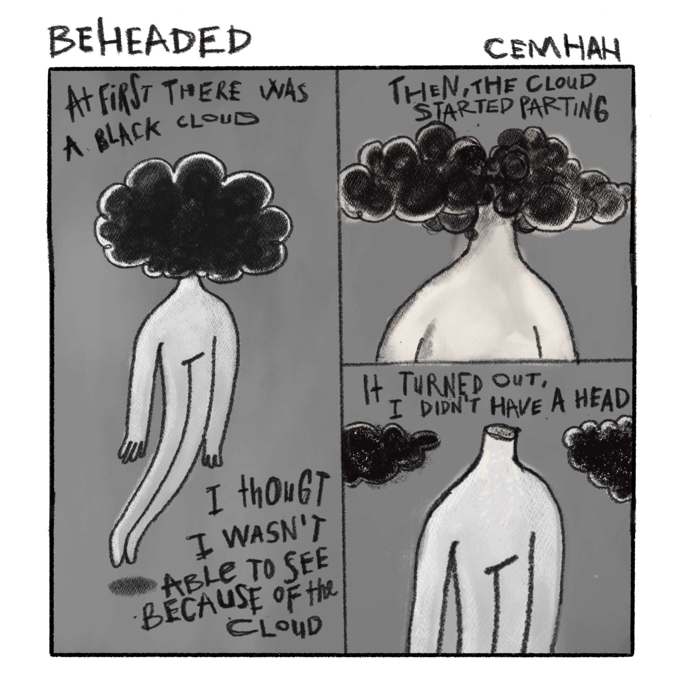

# Memory Glitches

“故障记忆是我自己的智能合约。”记忆并不是事件的准确记录。相反，在事件发生后，记忆会以多种不同的方式重建，这意味着它们可能会被多种因素扭曲。在这个系列中，我想借助一些想象和记忆扭曲来找回我的记忆。

▶ 什么是内存故障？
Memory Glitches 是一个 NFT（不可替代令牌）集合。存储在区块链上的数字艺术品集合。
▶ 存在多少内存故障代币？
总共有 2 个内存故障 NFT。目前 2 位所有者的钱包中至少有一个 Memory Glitches NTF。
▶ 最近卖出了多少内存故障？
过去 30 天内售出 0 个内存故障 NFT。

