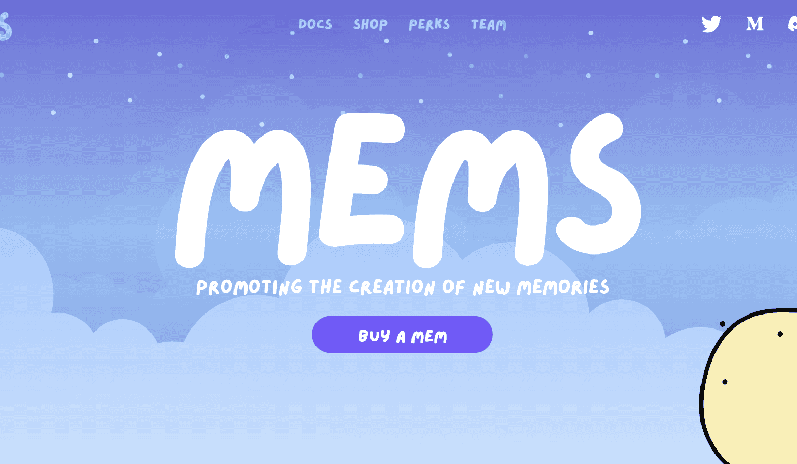

# Mems, Voyage One

mems 是一个 NFT 项目，旨在促进新记忆的创造并激励世界与他们的过去和现在建立更深层次的关系。mems 与全球各地的艺术家和创作者站在一起，使用 NFT + 新技术开发与我们周围世界的体验。

mems 系列中的 voyage one 是该项目的第一个产品。

什么是MEMS？

MEMS是可收藏的NFTS，它代表着每个人的真实世界记忆。这个以人类经验为重点的项目旨在促进
在这个美丽的世界里创造新的记忆
在我们周围。
MEMS还致力于成为建设可持续发展的关键参与者。
WEB3未来通过社区和对话-人们可以从内部创造并说出自己的想法的地方
真相。

故事

这个MEMS故事讲述的是乔治(是的，那些手握着你的MEM)，当他回到地球并给出颜色。
通过这些独特的MEMS回到人们身边。
在此之前，由于记忆战争和数十年的过度刺激，地球已经减少到灰色状态
从2022开始的黄金时代。
下面是完整的故事！

