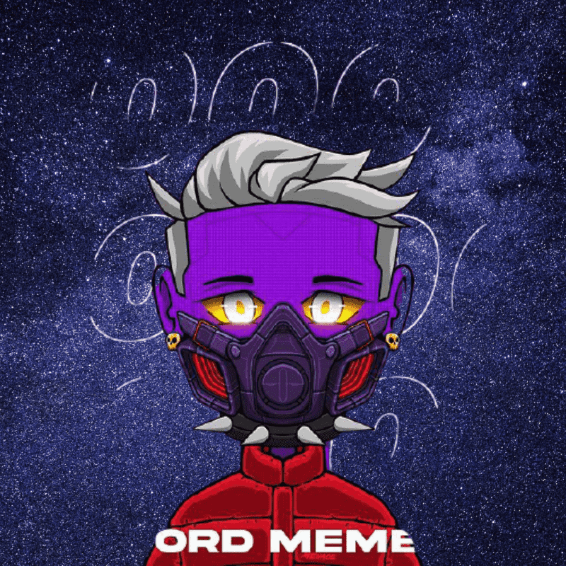

# Menace World

▶ 什么是威胁世界？
Menace World 是一个 NFT（不可替代代币）集合。存储在区块链上的数字艺术品集合。
▶ 存在多少威胁世界代币？
总共有 472 个威胁世界 NFT。目前，253 位所有者的钱包中至少有一份 Menace World NTF。
▶ Menace World 最近卖出了多少？
过去 30 天内售出 0 个 Menace World NFT。

威胁世界是由 400 多种手绘元素随机生成的 10,000 个独特头像的集合！

每个威胁都将被放入威胁世界，并有机会竞争以赢得更多威胁。

每个威胁都作为 ERC-721 令牌存储在以太坊区块链上。

让游戏开始。

