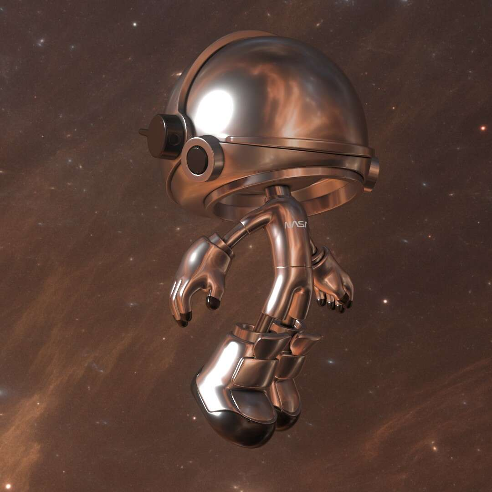

# Mendel Genesis Odyssey

Mendel Genesis Odyssey 是终极的“Mendel Pass”，可让您访问所有未来的 Mendel 收藏

超越太阳，超越以太，超越星空球体的范围。

Mendel 是由艺术家 Remy Bond 创作并由 weArt 引入元宇宙的角色。

孟德尔是一个探索宇宙和元宇宙的小宇航员，

试图理解生命的意义，以及一切……

Mendel Ex∞dus 是关于 Mendel 的 7 个相关集合中的第二个，将在 2022 年下降。

这套完整的系列将结合孟德尔的所有生态系统和所有元素（车辆、配件、行星......），将用于

最雄心勃勃的系列，孟德尔故事，一个分散的集体收藏，由孟德尔社区创建。

