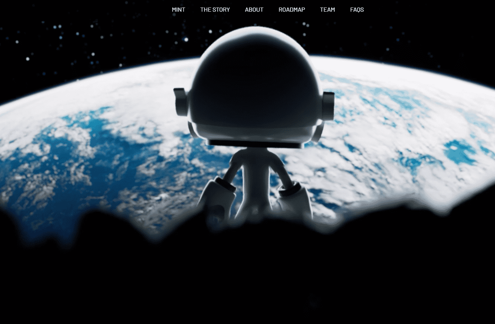

# Mendel Exoodus

Mendel Ex∞dus 是艺术家Remy Bond的 1800 个 NFT 集合，其艺术作品已在 NASA 肯尼迪航天中心展出。

继《孟德尔创世纪》之后，它继续了一位冒险的宇航员和他进入孟德尔宇宙的故事。

Mendel Ex∞dus 持有者将获得对未来 Mendel 收藏、IRL 艺术的独家访问权，以及对联合创始人 weArt 工作室提供的实用程序的访问权等。访

问孟德尔的网站了解更多详情。我是进步的粉丝，无论它来自哪里，也无论它带给我们什么。我生命中的挑战是帮助社会控制进步并与之一起进化，而不是让进步控制社会并在没有它的情况下进化。Generative Art 在元宇宙中占有非常重要的地位。

