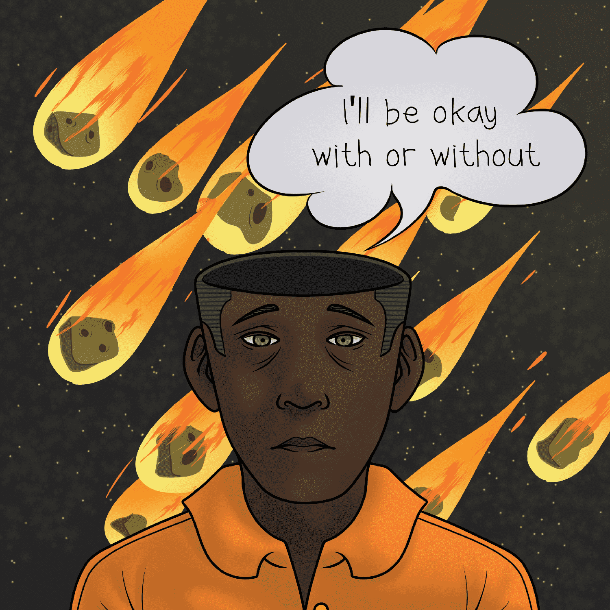

# Mentally Unstable NFT

在一个心理健康很难讨论的世界里，我们认为 3000 件 NFT 收藏品将成为连接现实的桥梁。

精神上不稳定的 NFT 是 3000 名不怕大声疾呼的不稳定平民的自觉集合！没有两个平民是相同的，你是独一无二的。

我们的想法始终是成为第一个引用心理健康的 NFT 系列，带来许多不同的健康推送引用和吸引人的特征来代表我们的微妙概念。

拥有平民将使您有权访问我们共享巨大利益的社区。由于此系列的唯一目的将始终是心理健康，因此希望每个实用程序都以某种方式遵循该意识形态！

