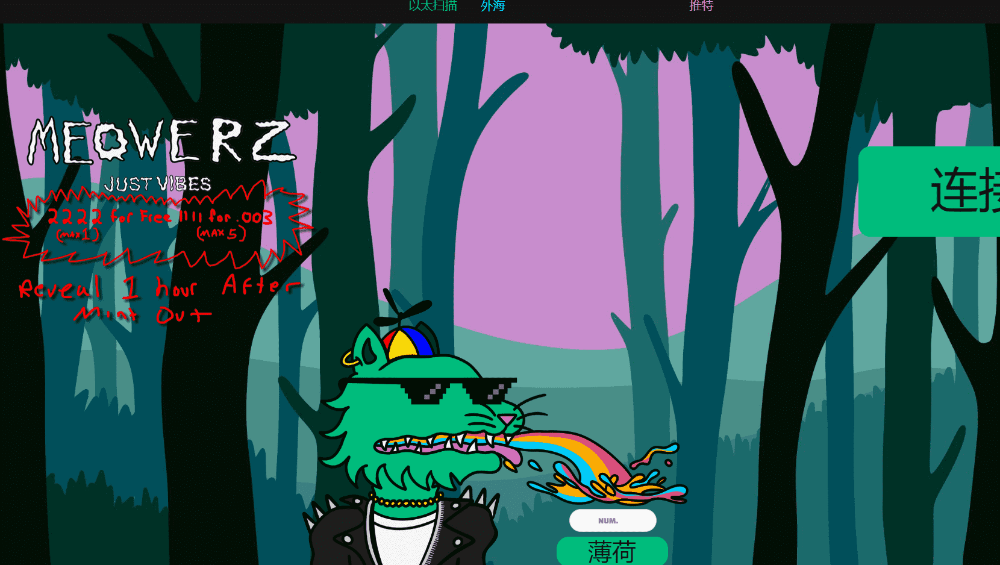

# Meowerz

什么是喵喵？

Meowerz 是一个 NFT（不可替代令牌）集合。存储在区块链上的数字艺术品集合。

存在多少 Meowerz 代币？

总共有 3,331 个 Meowerz NFT。目前，1,855 名所有者的钱包中至少有一个 Meowerz NTF。

 最昂贵的 Meowerz 销售是什么？

售出的最昂贵的 Meowerz NFT 是 [Meower #2269](https://www.nft-stats.com/asset/0x5aaa2d5ca27bb72605604ab35845c50e7ba88d5c/2269)。它于 2022-06-08（3 个月前）以 136.9 美元的价格售出。

 最近卖出了多少 Meowerz？

过去 30 天内售出了 410 个 Meowerz NFT。

 Meowerz 的价格是多少？

在过去 30 天里，最便宜的 Meowerz NFT 销售额低于 10 美元，最高销售额超过 40 美元。过去 30 天，Meowerz NFT 的中位价格为 18 美元。

