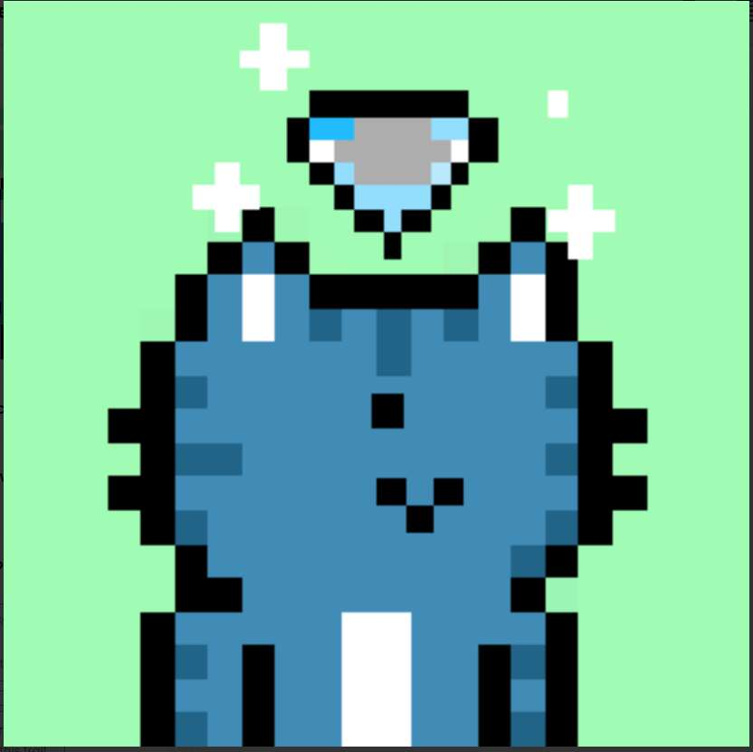

# MeowRunners

路线图是什么？Meowww 没有路 没有地图 喵。我们只是一些来自古老的 Catstown 的小猫前往 Mewoverse 讲述我们的故事。10,000 人随机生成到 Mewoverse，加入我们一起找出答案！你必须知道的另一件事。这都是关于毛皮球的。

Meowcatz NFT 在过去 7 天内售出 33 次。Meowcatz 的总销售额为 147.54 美元。一个 Meowcatz NFT 的平均价格为 4.5 美元。共有 1,039 名 Meowcatz 所有者，总共拥有 3,208 个代币。

▶ 什么是喵喵？
Meowcatz 是一个 NFT（不可替代令牌）集合。存储在区块链上的数字艺术品集合。
▶ 有多少 Meowcatz 代币？
总共有 3,208 个 Meowcatz NFT。目前，1,039 名所有者的钱包中至少有一个 Meowcatz NTF。
▶ 什么是最昂贵的 Meowcatz 销售？
Meowcatz NFT 售出的最昂贵的是 . 它于 2022 年 6 月 29 日（2 个月前）以 22 美元的价格售出。

