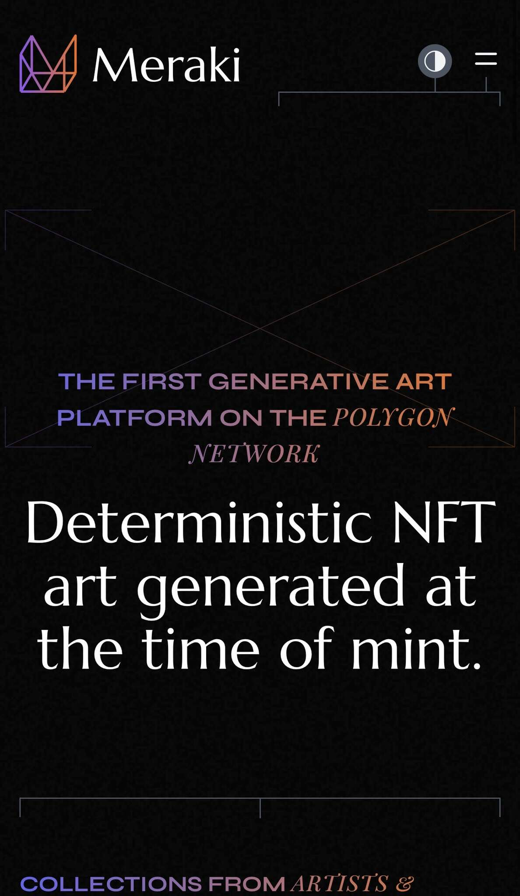

# Meraki Token

Polygon 上的第一个生成艺术平台。让艺术家在提供他们的艺术作品时具有更大的灵活性和访问权限。收藏家可以在节气的环境中发展和维护他们的画廊。拥有平台的一部分并分享它的成功！

Meraki 利用 Chainlink VRF 技术向生成艺术品的创作者和收藏者保证真正的随机性。

什么是 Chainlink VRF？

Chainlink VRF（可验证随机函数）是为智能合约设计的可证明公平且可验证的随机源。

它本质上是一个“防篡改随机数生成器”，它保证智能合约的输出（在这种情况下是生成艺术）是随机的。

