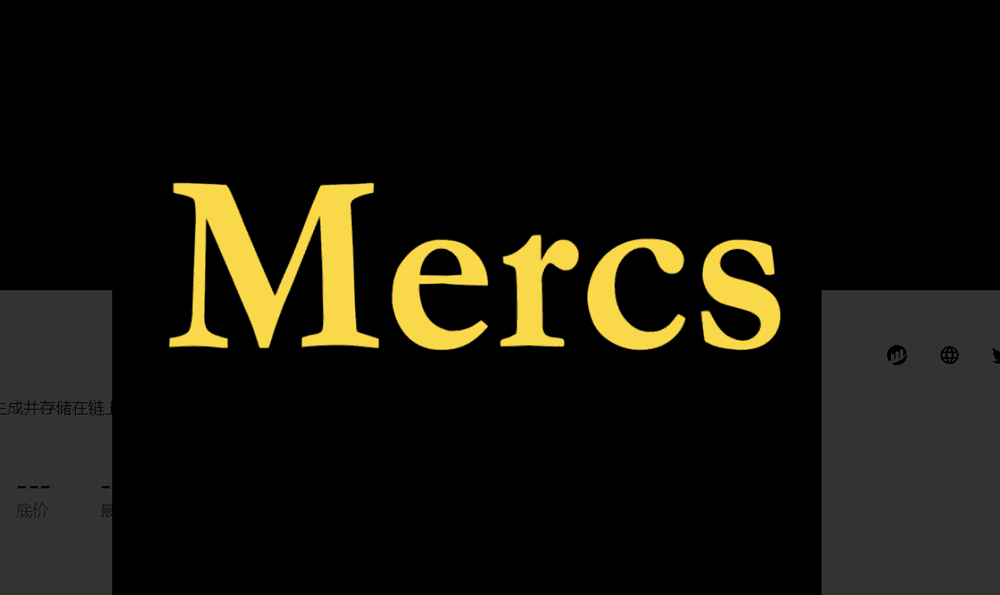

# Mercenary Party

雇佣兵团是一群雇佣的战士，是随机生成并存储在链上的佣兵团。使用 AGLD 雇用您的佣兵...宣布雇佣兵（为 AGLD）！*是什么让雇佣兵物有所值？* - 第一个[$ALGD](https://twitter.com/search?q=%24ALGD&src=cashtag_click)衍生战利品项目 - 没有开发人员分配！- 动态武士乐队供您的英雄雇佣/战斗 - 铸币厂按合约发布时间播种铸币厂价格：200[美元](https://twitter.com/search?q=%24ALGD&src=cashtag_click)好消息，MERCS 铸币界面现已上线！没有更复杂的合同，只需前往这里并以$AGLD的价格雇佣一些雇佣兵

什么是特工Mercenary Party的故事？

Mercenary Party故事是一个 NFT（非同质代币）集合。存储在区块链上的数字艺术品集合。

