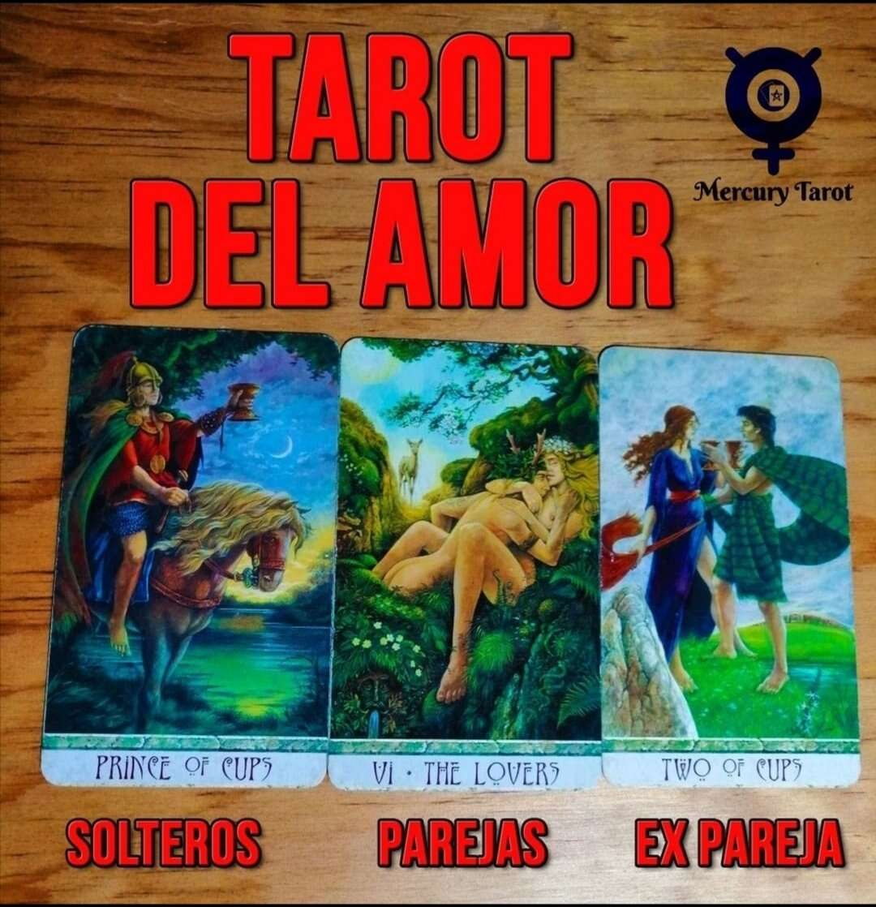

# Mercurio tarot

Mercurio 是一个易于使用的代币生成器，用于在以太坊区块链或币安智能链上创建 ERC20/BEP20 代币。无需注册、设置或编码。

我们希望让加密货币和区块链更接近社区，让每个人都有机会参与。这就是为什么我们使创建您自己的加密货币的过程尽可能简单的原因。

▶ 什么是 Mercurio 塔罗牌？
Mercurio 塔罗牌是一个 NFT（非同质代币）集合。存储在区块链上的数字艺术品集合。
▶ Mercurio 塔罗牌有多少？
总共有 3 个 Mercurio 塔罗牌 NFT。目前有 2 位所有者的钱包中至少有一张 Mercurio 塔罗牌 NTF。
▶ 最近卖出了多少Mercurio塔罗牌？
过去 30 天内共售出 0 个 Mercurio 塔罗牌 NFT。

