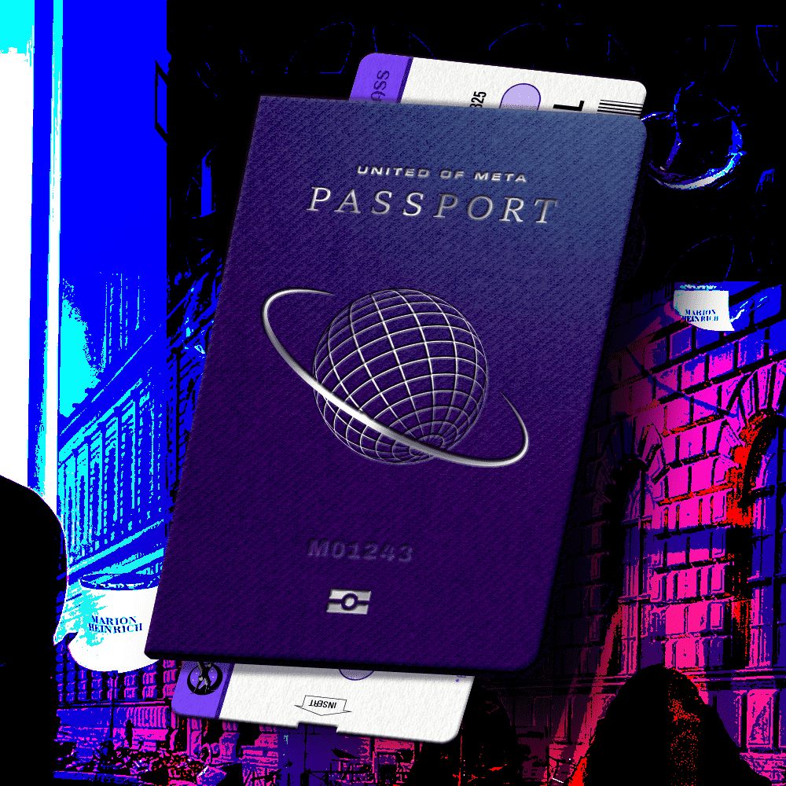

# Meta Airline Passport

META-AIRLINE 与我们现在的 2022 年息息相关。

我们对遥远的未来不感兴趣。我们专注于 META-AIRLINE NFT 代币经济学，并更方便地利用世界上所有的航空公司。

META-AIRLINE NFT 持有者将有机会在 Virtual Earth V1 中购买土地并在土地上建造机场。然后，机场和机票销售的收入将与土地所有者分享。

只有 META-AIRLINE NFT 持有者才能购买机票。

车票分为经济舱、商务舱和头等舱三种。每位持有人最多可购买三张门票。每一张票都加速了 DeFi 挖矿的速度。

经济舱、商务舱、头等舱票的比例固定为380：100：20。

99% 的 $MAL 代币将分发 META-AIRLINE NFT

