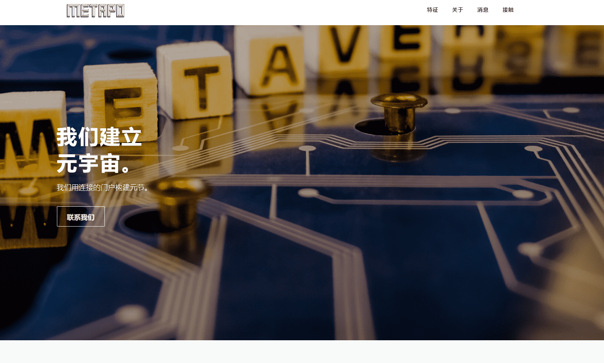

# Meta Builder Genesis

我们用连接的门户构建元节。

为地方政府、公司和公共机构提供元界咨询——战略制定咨询和路线图、元界平台、区块链和NFT
Metaverse 简介，主要平台上的实践培训 – Gather Town、Zep、Spot、Spatial、Mozilla Hubs）
大数据咨询与教育、数据可视化服务——日常生活中的大数据、公民数据分析师培训课程
开发和提供基于开源的数字孪生解决方案（包括基于AIoT的传感技术和大数据平台）
提供基于区块链技术的开放式元界平台的咨询、教育、服务和传播。

